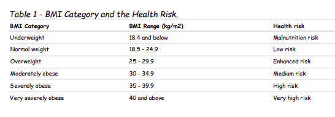

# BMI calculator

---------------------------------------
A small app which classify the obesity of a person derived from the mass and height

### BMI Formula:
BMI(kg/m²) = mass(kg) / height(m)²

### BMI Category / health risk 

### Python version used:
3.8

### Librairies in use:
* pyspark
* pytest

### How to run:
Be sure to have the path pointed inside the project directory then run the command:
* in linux OS.
> ./bmi_calculator.py
* in windows OS
> py -m bmi_calculator.py

### How to test:
Be sure to have the path pointed inside the project directory then run the command:
> pytest